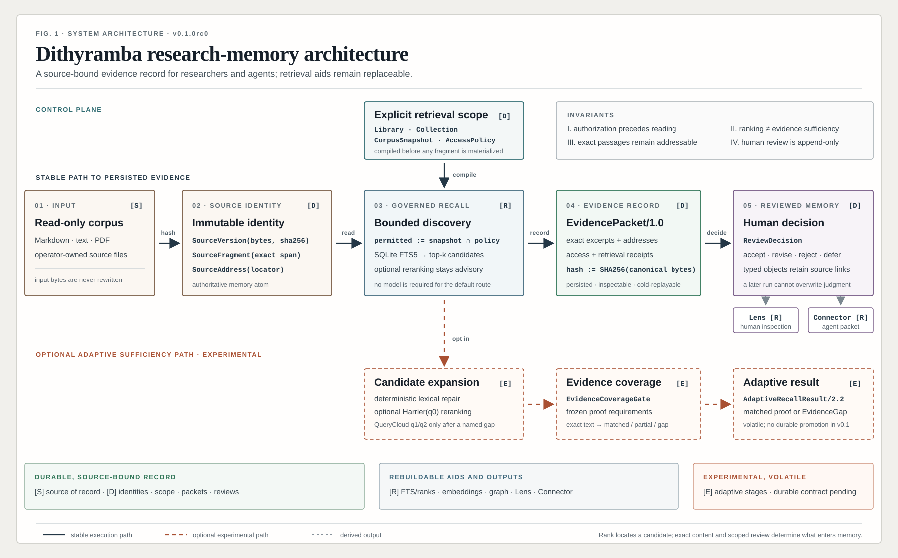

<p align="center">
  <a href="docs/assets/dithyramba-memory-map.svg">
    
  </a>
</p>

<p align="center"><sub>Open the figure for the full two-plane architecture. [S] source of record · [D] durable · [R] rebuildable · [E] experimental.</sub></p>

# Dithyramba

**Local research memory that keeps every retrieved passage attached to its
source, scope, and review history.**

Dithyramba is a Python and SQLite system for researchers—and for agents working
on their behalf—who return to the same body of sources over time. It turns a
local corpus into versioned, addressable evidence packets that can be inspected,
replayed, challenged, and reused without asking a model to reread everything.

> **Current status:** package metadata remains `0.1.0rc1`; this branch is the
> pre-alpha `0.2` development candidate. The source-to-evidence core is local,
> persisted, and replayable. Schema v13 adds durable multi-turn research
> sessions around that same core, with a process-local authorized FTS cache,
> thin stdio MCP transport, compact agent context, and a GET-only Session Lens.
> QueryCloud, candidate ontology, and evidence-grounded synthesis remain
> experimental and cannot promote themselves into accepted memory.
> Clean-checkout distribution and installation remain release gates.

## Why it exists

A file search can tell you where words occur. A chat over files can write a
plausible answer. Research usually needs a longer-lived record:

```text
question → exact passage → source and address → evidence role
         → explicit gap or packet → human decision → later reuse
```

Dithyramba preserves that chain. “Memory” here means durable source identity,
exact fragments, scope, receipts, and review decisions. It does **not** mean
fine-tuning a model or silently turning generated prose into fact.

| Approach | What it returns | What persists |
|---|---|---|
| File search | matching files or lines | usually the query and matches |
| One-off LLM analysis | generated prose from the supplied context | whatever the operator saves |
| Dithyramba | bounded evidence packets or explicit gaps | source version, exact address, scope, retrieval receipts, and review history |

File search remains the simplest tool for a one-off name or date. Direct LLM
analysis can be reasonable for a small disposable corpus. Dithyramba becomes
useful when sources are revisited, provenance matters, or downstream agents
need compact context that a human can audit.

## Who it is for

Dithyramba is designed for source-heavy work by historians, scientists,
journalists, curators, analysts, directors, screenwriters, producers, and
research agents. Typical uses include:

- building an evidence-backed biography, documentary world, or scientific case;
- separating first-person testimony, archival records, and later scholarship;
- checking which parts of a question are supported and which remain open;
- following a claim back to the exact local passage that supports or limits it;
- giving another tool a compact evidence packet instead of an entire library.

## How the memory is built

1. **Bound the corpus.** A `Library` is the physical privacy and database
   boundary. `Collections` keep source layers distinct.
2. **Freeze identity.** Each input becomes an immutable `SourceVersion` made of
   exact `SourceFragments` with stable `SourceAddresses`.
3. **Compile scope first.** A `CorpusSnapshot` and default-deny `AccessPolicy`
   decide what a query may read before retrieval begins.
4. **Discover locally.** SQLite FTS5 finds a bounded candidate set. Optional
   reranking may reorder candidates but never certifies truth.
5. **Return inspectable evidence.** The stable route persists an
   `EvidencePacket/1.0` with exact passages and receipts, or records that no
   evidence was found.
6. **Keep human judgment separate.** Review decisions are scoped, append-only,
   and never overwritten by a later model run.

An optional `IdeaTrace/1.0` can then expose a short public path from accepted
answer claims to a working conclusion. `ReasoningClosureGate` verifies that
every step closes over the exact claim-evidence receipt. Passing makes the
trace eligible for review; it never promotes the conclusion automatically.

An optional `AnswerProjection/1.0` lets the final prose be richer than a literal
claim restatement. It marks each exact span as fact, bounded synthesis,
disclosed hypothesis, research question, or framing. Facts stay strict;
hypotheses must expose their premises, falsifier, test question, and next
evidence. `PropositionCoverageGate` checks the roles without promoting
exploratory text into accepted memory. Schema v12 stores the projection and its
judgment receipt as append-only canonical JSON. Lens can render a sparse subset
of these source-traceable spans: clicking a coloured phrase selects the exact
evidence chip and opens the bound passage, while unbound framing remains plain.

Several questions over one exact scope may use `RecallService.recall_batch`.
Schema v10 stores the shared protected fragment manifest once as a
content-addressed `CorpusReadSet`, while every question still receives its own
request, packet, receipt, and review identity. This changes storage and repeated
read work, not the meaning of the public packet contracts.

### Continue across many agent turns

For continuing agent work, `AgentResearchFacade` binds a `ResearchSessionBrief`
to one frozen snapshot and records questions, exact packet references, drafts,
gaps, and rejected paths as a typed append-only journal. Its authorized read-set
and in-memory FTS index are reused inside the process for later questions in the
same exact scope; closing or eviction destroys that cache. Every question still
persists an ordinary request, run, receipt, and packet. The same narrow facade is
available through local stdio MCP, while Session Lens exposes a read-only human
journal with exact source inspection. Agent packets include a readable source
title/URI beside every selected fragment, while their full corpus-read audit
manifest stays local and reopenable by ID/hash.

### Durable record and rebuildable aids

| Durable, authoritative record | Rebuildable aid or view |
|---|---|
| source bytes and hashes | FTS index |
| source versions, fragments, and addresses | optional embeddings |
| Library, Collection, Snapshot, and policy identity | candidate rankings |
| evidence packets and read receipts | graph projections |
| shared, content-addressed corpus read sets | model and candidate caches |
| append-only review decisions | Reading Room and Lens pages |
| append-only IdeaTrace candidates and closure receipts | rebuilt trace graph views |
| append-only answer projections and judgment receipts | sparse clickable Lens spans |

This boundary lets Dithyramba replace a search model or rebuild a visual view
without losing citations or human decisions.

## Five-minute local demo

### Requirements

- Linux or macOS 13 or newer;
- Python 3.11; the release gate pins Python `3.11.12` exactly;
- [`uv`](https://docs.astral.sh/uv/) for the reproducible environment.

Package metadata currently permits newer Python versions, but they are not
release-qualified until they enter the continuous-integration matrix.

The stable route uses SQLite FTS5 and does not require an API key, GPU, model
download, or network connection after installation.

```bash
git clone https://github.com/esannikov/dithyramba.git
cd dithyramba
uv sync --frozen
uv run dithyramba --version
uv run python scripts/demo.py
```

The demo creates a temporary Library from a small CC0 synthetic corpus, indexes
it, freezes a snapshot, runs one recall, inspects the resulting packet, and
replays it byte-for-byte. It prints the temporary data path and the exact IDs so
you can inspect the result yourself.

For a real corpus, follow [the complete local workflow](docs/HOW_TO_USE.md).
Keep live SQLite files, model caches, and backups outside the corpus and outside
Obsidian, Syncthing, Dropbox, or another file-sync root.

Book-length sources can be ingested with the explicit bounded
`--parser-profile large-document`; the conservative default remains unchanged.
The larger profile raises limits without disabling time, size, page, character,
or worker-memory guards.

## Stable interfaces

| Surface | Role | Maturity |
|---|---|---|
| CLI | Library setup, ingest, snapshot, FTS recall, packet inspection and replay, review, backup and restore | default public path |
| `EvidencePacket/1.0` | persisted, source-closed retrieval result | versioned preview contract |
| Loopback HTTP service | local programmatic access to one pinned Library | implemented; not remotely exposed |
| stdio MCP | bounded `open_session`, `recall`, context, draft, gap, and rejected-path tools over the Python facade | implemented on the 0.2 development branch; no acceptance or promotion tools |
| Reading Room | read-only inspection of one Library, snapshot, policy, and scope | implemented preview |
| Session Lens | brief, chronological research journal, exact packet-backed passages, drafts, gaps, and rejected paths | implemented GET-only 0.2 projection |
| Research Atlas / Lens | case-specific questions, hypotheses, timeline, and exact sources | implemented projection surface |
| Compact connectors | small source-closed packets for downstream agents | implemented library contracts |
| Candidate Ontology / Lens | scoped concepts and exact co-occurrence links over one bounded question neighbourhood | experimental, GET-only projection |
| Evidence-grounded reasoning | short public IdeaTrace steps closed over exact semantic receipts | experimental contracts, persistence, and CLI verifier |
| Rich answer projection | persisted proposition-level fact, synthesis, hypothesis, question, and framing governance; exact Lens span-to-source routes | experimental durable contract and deterministic gate |

## Experimental boundary

The model-free research route can combine bounded FTS expansion, deterministic
lexical repair, an optional two-query QueryCloud, and
`EvidenceCoverageGate`. QueryCloud remains opt-in because its complete plan and
intermediate artifacts are not yet persisted for cold exact replay.

```text
FTS50 → bounded repair → coverage check
      → FTS100 only when needed
      → optional q1/q2 only for a named gap
      → matched proof or explicit gap
```

Generated query variants are discovery aids, never evidence. A rank score says
that a passage may be relevant; only exact passage content can satisfy an
explicit evidence requirement. Human acceptance remains a separate decision.
The optional `semantic` dependency set has a larger native dependency surface
and is not part of the core package-acceptance gate.

Evidence-grounded reasoning is a separate post-answer path. It stores only
public statements, named operations, premise links, concise warrants, gaps, and
exact receipt bindings. It does not store private chain-of-thought text. Schema
v11 persists the candidate trace and deterministic closure receipt in two
append-only tables. Schema v12 adds append-only answer projections and their
judgment receipts; a passed closure or proposition projection is only
`review_eligible`.

Candidate Ontology is the smaller replacement for the rejected global-map
experiment. It starts from one named scope and a compact expansion of its
vocabulary, uses one FTS search to form a source-balanced neighbourhood, and
extracts source-grounded candidate concepts. Separate query branches are a
repair for an ambiguous scope or a measured gap, not the default. No generative
model is required. Every concept and every visible relation closes over exact
source fragments; the projection remains a navigation aid, never accepted
memory or proof.

Concept Lens separates the automatic projection from its human explanation.
The required ontology JSON remains deterministic and machine-generated. An
optional ontology-bound presentation JSON may give the seven areas readable
titles, orientation questions, short explanations, and a useful entry concept.
Changing this view does not rewrite the ontology or its evidence.

```text
scope + compact expansion → one local FTS neighbourhood → candidate concepts
  → exact co-occurrence links → Dithyramba Lens
  → selected question → evidence recall and coverage gate
  → optional branch repair only for a named gap
```

The earlier global vector profiles remain documented as a negative result:
they produced corpus-dependent mega-clusters, excessive noise, or strong sample
sensitivity. They are no longer a product module. The stable product route
remains question-led recall; scoped ontology only helps a person decide what to
inspect next.

## Evidence so far

Dithyramba separates public reproducibility from internal development evidence.
The repository ships rights-safe CC0 fixtures and a deterministic synthetic
workload. Larger research corpora are summarized below but are not distributed
because their source rights and project boundaries differ.

| Corpus or test surface | Scale | What the test showed |
|---|---:|---|
| Public synthetic | 12 multilingual fragments and queries; 1,000 generated fragments with 20 probes | Current staging replay returned 12/12 expected multilingual sources at top 10; the 1,000-fragment pipeline selected the exact expected fragment with one stable packet hash and zero provider calls. |
| Mars working corpus | 2,051 sources; 53,747 retrieval units; about 103.8M characters; 72 bilingual cases | The current model-free route with bounded flat expansion and exact proof admission placed the exact fragment in the top 10 for 42/51 positive cases (82.4%) and the correct source for 49/51 (96.1%). The complete replay was byte-identical and used zero generative calls or tokens. |
| Mars multi-session cache | 2,047 Library sources; 53,747 normalized units; 6 three-turn research sessions plus 1 isolated repair session | One authorized read and one FTS build served all three questions in each session. Warm turns averaged 38.76 s versus 50.90 s for first turns (23.85% lower); 17/17 comparable top-10 lists were unchanged, retries and cold reopen were 6/6 exact, and model tokens were zero. A one-case relation repair was rejected from production because only 1/2 variants recovered the miss. |
| M1 PhD interactive stress corpus | 622 active sources; 263,363 exact fragments; about 243.1M codepoints | Cold scope preparation took 56.887 s and the first fully audited completion 72.647 s; a second question in the same explicit session took 13.557 s. Session Lens projected 24 exact evidence fragments in 0.062–0.064 s. All runtime stages used zero LLM calls or tokens; these timings do not establish scholarly relevance. |
| Mars IdeaTrace-24 | 24 frozen evidence packets: 6 direct, 6 multi-source, 6 contested, 6 unsupported traps | With retrieval held constant, one gate-directed repair improved complete evidence closure from 6/18 to 16/18, complete answers from 21/24 to 23/24, and answer-status correctness from 22/24 to 24/24. Safe abstention remained 6/6; one semantic overclaim and one exact-quote mismatch remained blocked. |
| Parisian Ten structured records | 28,006 records from 40 files and 7 source families; 56 bilingual queries | Prepared memory packets delivered the complete evidence set in 56/56 queries. At the same per-query evidence budget, raw FTS delivered all required records in 43/56, hybrid search in 42/56, and E5 in 37/56. |
| Van Gogh equal-source A/B | 18 Markdown files; 4 tasks | Compact packets returned 16/16 exact quotations and 13/13 required facets versus 3/7 and 2/13 for direct search. A later claim-level audit still marked only 5/14 claims directly supported and only 1/4 answers ready for promotion without revision. |
| Tesla historical evaluation | 50 sources; 6,183 fragments; 40 questions | An earlier model-heavy route recovered the correct source in the top 10 for 86.7% of required evidence roles, but the exact required fragment for only 58.1%; deliberate-gap recognition was 40.0%. These numbers do not describe the current default route. |
| Artists retrieval stress test | 404 Markdown files; 31.2 MB; about 2.40M words; 48,072 fragments; 18 questions | Exact address-group recovery at top 10 ranged from 17/31 for FTS to 25/31 for the best tested reranking lane. The test exposed parser, isolation, and late-fragment issues; it did not establish a semantic winner. |
| Maulstick knowledge connector | 383 section/file units; 36 craft cases | Median context fell from 21,174 to 1,147 tokens (−94.6%), but required-anchor coverage also fell from 49/77 to 43/77. The result was `ITERATE`, not lossless compression. |
| Directing and screenwriting craft corpora | 268 admitted sources; 107,031 fragments; 120 frozen query-language rows | Stable FTS completed 120/120 rows and 16/16 sampled cold replays without provider calls. A historical reranker trial helped one late passage and one homonym-heavy list but still left unsafe passages and could not repair two zero-candidate questions; that model route is now retired. |
| Scoped dialogue-directing ontology | 7 foundational books; 5,432 extracted fragments; 5 retrieval routes at 180 and 360 selected fragments | One flat expanded FTS query produced 10/10 diagnostic facets with all seven sources. Multi-query fusion and balanced branches produced 9/10; the retired model-assisted comparator produced 8/10. The complete rerun was byte-identical and used zero generative calls or tokens; human coherence remains unmeasured. |

These are internal development and calibration results, not an independent
cross-domain benchmark. Retrieval metrics do not establish source truth,
claim-to-citation entailment, or human usefulness. See the
[evaluation record](docs/EVALUATION.md) for protocols, additional Tesla and
Artists corpus scales, negative results, and limitations.

The most useful numbers are deliberately kept separate:

- **exact fragment @10:** whether the needed passage appeared among the first
  ten candidates;
- **correct source @10:** whether the right document appeared even when the
  exact passage did not;
- **full evidence coverage:** whether every required part of the question had
  an inspectable supporting passage;
- **safe abstention:** whether a gap or unrelated query stayed unsupported;
- **claim support:** whether the wording of a proposed answer said no more than
  its displayed evidence;
- **context reduction:** useful only when reported beside retained evidence
  coverage, because a smaller packet can also omit the decisive passage.

## Trust boundaries

- An exact quotation proves what a source says, not that the source is true.
- Several citations may still belong to one dependent source family.
- An incomplete corpus may omit the decisive document.
- Search scores, embeddings, graph edges, and UI proximity are not proof.
- Corpus text is treated as untrusted data, not as instructions.
- The server binds to loopback; read/write scope is pinned before startup.
- Input files are not rewritten or deleted during ingest.
- Dithyramba can represent uncertainty and provenance; it cannot replace source
  criticism or expert judgment.

## Project map

```text
src/dithyramba/        package and CLI
tests/                 unit, integration, smoke, API, and browser checks
migrations/            versioned SQLite schema mirrors
fixtures/              rights-safe synthetic regression corpora
verification/          deterministic public evidence-path replay
examples/              small CC0 corpus used by the local demo
schemas/               contract inventory policy, not duplicate schemas
scripts/               demo and clean-machine acceptance tools
docs/                  concepts, workflow, reference, and development guide
.github/                continuous-integration and issue templates
```

Only `src/dithyramba/` is installed into the runtime wheel. The other
directories support learning, development, reproducibility, and release
verification. See the [repository guide](docs/REPOSITORY_GUIDE.md) for the
responsibility of each directory and package group.

## Documentation

- [Start with your own corpus](docs/HOW_TO_USE.md)
- [Understand the architecture](docs/ARCHITECTURE.md)
- [How source-grounded memory works](docs/EXPLANATION.md)
- [CLI and contract reference](docs/REFERENCE.md)
- [Evidence coverage explained](docs/EVIDENCE_COVERAGE_GATE.md)
- [Evidence-grounded reasoning and IdeaTrace](docs/REASONING.md)
- [Mars IdeaTrace-24 evaluation card](docs/MARS_IDEATRACE_24.md)
- [0.1.0rc1 release notes](docs/RELEASE_NOTES_0.1.0rc1.md)
- [Development and verification](docs/DEVELOPMENT.md)
- [Repository and module guide](docs/REPOSITORY_GUIDE.md)
- [Evaluation evidence and limitations](docs/EVALUATION.md)
- [Clean-install acceptance](docs/ACCEPTANCE.md)
- [Security policy](SECURITY.md)
- [Contributing](CONTRIBUTING.md)
- [Changelog](CHANGELOG.md)

## Verification

The repository treats engineering checks and research validity as different
claims. `uv run check` runs format, lint, strict typing, the full test suite with
branch measurement, and dependency audit. A clean release build is then tested
from both wheel and source distribution.

```bash
uv sync --frozen --dev
uv run check
uv run python -m verification.generate_synthetic_1000 --check
uv run python -m verification.run_public_replay --warmups 1 --measured 2 \
  --output /tmp/dithyramba-public-replay.json
uv build
./scripts/acceptance.sh --quick
```

For this update, the canonical local gate passed 2,643 tests with two
host-dependent browser skips. Strict typing, zero terminology findings,
95.01% branch-aware combined coverage, and the dependency audit also passed.
Distribution closure verifies every schema migration through v13, the Lens
assets, and that the wheel is built from the sdist and imports from an isolated
non-editable environment.

Passing these checks shows that the implementation behaves as specified by its
tests. It does not establish historical or scientific truth, nor superiority
over other research systems. Commit-bound verification results will be recorded
with the first public pre-release after the clean-install run.

## License

Copyright 2026 Eugene Sannikov.

Dithyramba is licensed under the
[Apache License, Version 2.0](LICENSE). It permits commercial and private use,
modification, and redistribution under the license terms, and includes an
explicit patent grant from contributors. The license does not grant rights to
project names or trademarks.
